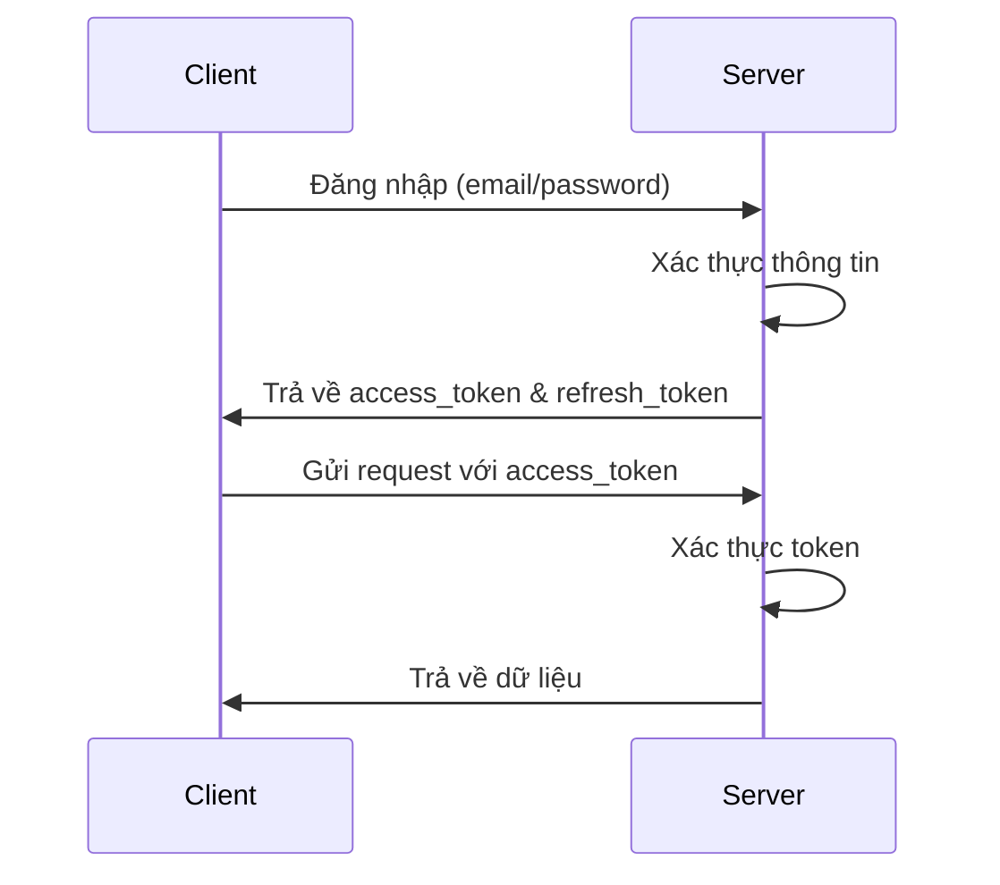
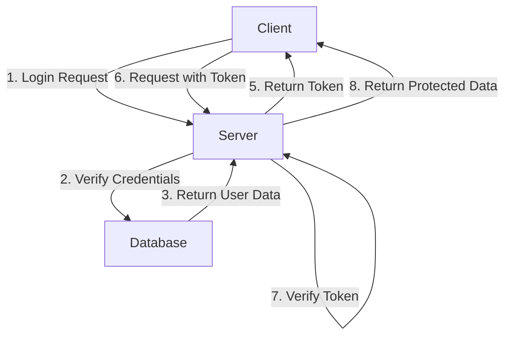

# Hướng Dẫn Xác Thực JWT (JSON Web Token)

## 1. Tổng Quan về JWT

JWT (JSON Web Token) là một chuẩn mở (RFC 7519) định nghĩa cách truyền thông tin an toàn giữa các bên dưới dạng đối tượng JSON. Token này có thể được xác minh vì nó được ký điện tử.



## 2. Cài Đặt Dependencies

```bash
pip install python-jose[cryptography] passlib[bcrypt] python-multipart
```

## 3. Thiết Lập JWT

### 3.1 Cấu hình JWT (app/core/security.py)

```python
from datetime import datetime, timedelta
from typing import Optional
from jose import JWTError, jwt
from passlib.context import CryptContext

# Cấu hình bảo mật
SECRET_KEY = "your-secret-key"  # Nên lưu trong biến môi trường
ALGORITHM = "HS256"
ACCESS_TOKEN_EXPIRE_MINUTES = 30

# Password context
pwd_context = CryptContext(schemes=["bcrypt"], deprecated="auto")

def verify_password(plain_password: str, hashed_password: str) -> bool:
    """Xác thực password"""
    return pwd_context.verify(plain_password, hashed_password)

def get_password_hash(password: str) -> str:
    """Hash password"""
    return pwd_context.hash(password)

def create_access_token(data: dict, expires_delta: Optional[timedelta] = None) -> str:
    """Tạo access token"""
    to_encode = data.copy()
    if expires_delta:
        expire = datetime.utcnow() + expires_delta
    else:
        expire = datetime.utcnow() + timedelta(minutes=ACCESS_TOKEN_EXPIRE_MINUTES)
    
    to_encode.update({"exp": expire})
    encoded_jwt = jwt.encode(to_encode, SECRET_KEY, algorithm=ALGORITHM)
    return encoded_jwt

def verify_token(token: str) -> dict:
    """Xác thực token"""
    try:
        payload = jwt.decode(token, SECRET_KEY, algorithms=[ALGORITHM])
        return payload
    except JWTError:
        return None
```

### 3.2 Authentication Dependencies (app/core/deps.py)

```python
from fastapi import Depends, HTTPException, status
from fastapi.security import OAuth2PasswordBearer
from jose import JWTError, jwt
from sqlalchemy.orm import Session

from app.core.security import SECRET_KEY, ALGORITHM
from app.db.database import get_db
from app.services.user_service import UserService

oauth2_scheme = OAuth2PasswordBearer(tokenUrl="auth/login")

async def get_current_user(
    token: str = Depends(oauth2_scheme),
    db: Session = Depends(get_db)
):
    """
    Dependency để lấy current user từ token
    Sử dụng trong các protected endpoints
    """
    credentials_exception = HTTPException(
        status_code=status.HTTP_401_UNAUTHORIZED,
        detail="Could not validate credentials",
        headers={"WWW-Authenticate": "Bearer"},
    )
    
    try:
        # Giải mã token
        payload = jwt.decode(token, SECRET_KEY, algorithms=[ALGORITHM])
        user_id: str = payload.get("sub")
        if user_id is None:
            raise credentials_exception
            
    except JWTError:
        raise credentials_exception
        
    # Lấy user từ database
    user = await UserService.get_user(db, user_id)
    if user is None:
        raise credentials_exception
        
    return user
```

## 4. Implement Authentication Routes

### 4.1 Authentication Schema (app/api/schemas/auth.py)

```python
from pydantic import BaseModel

class Token(BaseModel):
    access_token: str
    token_type: str

class TokenData(BaseModel):
    username: str | None = None

class Login(BaseModel):
    username: str
    password: str
```

### 4.2 Authentication Routes (app/api/routes/auth.py)

```python
from datetime import timedelta
from fastapi import APIRouter, Depends, HTTPException, status
from fastapi.security import OAuth2PasswordRequestForm
from sqlalchemy.orm import Session

from app.core.security import (
    verify_password,
    create_access_token,
    ACCESS_TOKEN_EXPIRE_MINUTES
)
from app.api.schemas.auth import Token
from app.services.user_service import UserService
from app.db.database import get_db

router = APIRouter()

@router.post("/login", response_model=Token)
async def login(
    form_data: OAuth2PasswordRequestForm = Depends(),
    db: Session = Depends(get_db)
):
    # Xác thực user
    user = await UserService.get_user_by_email(db, form_data.username)
    if not user:
        raise HTTPException(
            status_code=status.HTTP_401_UNAUTHORIZED,
            detail="Incorrect username or password",
            headers={"WWW-Authenticate": "Bearer"},
        )
        
    # Xác thực password
    if not verify_password(form_data.password, user.password_hash):
        raise HTTPException(
            status_code=status.HTTP_401_UNAUTHORIZED,
            detail="Incorrect username or password",
            headers={"WWW-Authenticate": "Bearer"},
        )
        
    # Tạo access token
    access_token_expires = timedelta(minutes=ACCESS_TOKEN_EXPIRE_MINUTES)
    access_token = create_access_token(
        data={"sub": str(user.id)},
        expires_delta=access_token_expires
    )
    
    return {
        "access_token": access_token,
        "token_type": "bearer"
    }
```

## 5. Sử Dụng Authentication trong Protected Routes

### 5.1 Protected Route Example

```python
from fastapi import APIRouter, Depends
from sqlalchemy.orm import Session

from app.core.deps import get_current_user
from app.db.database import get_db
from app.api.models.user import User

router = APIRouter()

@router.get("/me")
async def read_users_me(
    current_user: User = Depends(get_current_user)
):
    """
    Protected endpoint - chỉ user đã đăng nhập mới truy cập được
    Token phải được gửi trong header: Authorization: Bearer <token>
    """
    return current_user
```

## 6. Testing JWT Authentication

### 6.1 Login và lấy token

```bash
# Login và lấy token
curl -X POST "http://localhost:8000/auth/login" \
     -H "Content-Type: application/x-www-form-urlencoded" \
     -d "username=user@example.com&password=password123"
```

### 6.2 Sử dụng token để truy cập protected route

```bash
# Truy cập protected route với token
curl -X GET "http://localhost:8000/users/me" \
     -H "Authorization: Bearer <your_access_token>"
```

## 7. Best Practices và Security

### 7.1 Security Checklist

1. **Secret Key**
   - Sử dụng strong secret key
   - Lưu trong biến môi trường
   - Thay đổi định kỳ

2. **Token Management**
   - Set expiration time phù hợp
   - Implement refresh token flow
   - Blacklist revoked tokens

3. **Password Security**
   - Hash password trước khi lưu
   - Sử dụng salt
   - Implement password policy

### 7.2 Error Handling

```python
# Các exception cần xử lý
class AuthenticationError(Exception):
    pass

class TokenExpiredError(Exception):
    pass

class InvalidTokenError(Exception):
    pass

# Xử lý lỗi
@app.exception_handler(AuthenticationError)
async def authentication_exception_handler(request, exc):
    return JSONResponse(
        status_code=401,
        content={"message": "Authentication failed"}
    )
```

## 8. Flow Hoạt Động Của JWT



1. Client gửi credentials (username/password)
2. Server xác thực thông tin với database
3. Nếu hợp lệ, tạo JWT token
4. Token được gửi về client
5. Client sử dụng token này trong header của các request sau
6. Server xác thực token trước khi xử lý request

## 9. Development Tips

1. **Debug Token**
```python
# Decode token để debug
from jose import jwt
token = "your_token_here"
decoded = jwt.decode(token, SECRET_KEY, algorithms=[ALGORITHM])
print(decoded)
```

2. **Test Authentication**
```python
# tests/test_auth.py
from fastapi.testclient import TestClient
from app.main import app

client = TestClient(app)

def test_login():
    response = client.post(
        "/auth/login",
        data={"username": "test@example.com", "password": "password123"}
    )
    assert response.status_code == 200
    assert "access_token" in response.json()
```

## 10. Common Issues và Solutions

1. **Token expired**
   - Implement refresh token flow
   - Tăng thời gian hết hạn của token
   - Tự động refresh token khi gần hết hạn

2. **Invalid token**
   - Kiểm tra format của token
   - Verify signature
   - Kiểm tra thời gian hết hạn

3. **Authorization header missing**
   - Thêm middleware kiểm tra header
   - Return clear error message
   - Document API requirements